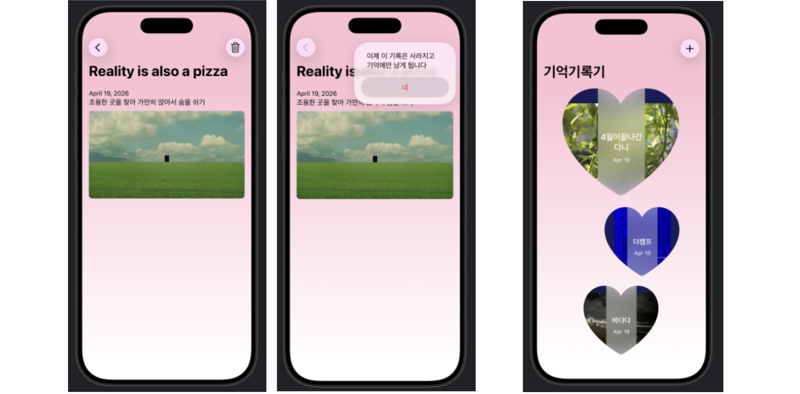

## [App Development] 1-1. Views and data storage: Collect, model, and store data

<https://developer.apple.com/tutorials/develop-in-swift/collect-model-and-store-data>


- 갤러리에서 사진 선택하기 ` PhotosPicker(selection: $newImg) {...} `
    - `PhotosPicker`는 iOS에서 사진 라이브러리 선택 UI를 띄워주는 뷰
    - `selection: $newImg` --> 사용자가 선택한 사진이 newImg에 $바인딩됨
    


- 툴바에서 데이터 삭제할 때, 경고창 띄우기 `.confirmationDialog`
    ```Swift
    // 입력한 정보를 실수로 삭제하지 않도록 표시!!!
    .confirmationDialog("삭제의 순간 최종 확인", isPresented: $isShowingCancelConfirmation) {
        Button("기록을 떠나보낼게요", role: .destructive) {
            dismiss() // 버튼 누르면 창 닫음
        }
    }
    ```

- **SwiftData @Model** 파일 : `Moment.swift`

    
- **SwiftData Container** 파일: `DataContainer.swift`
    - 데이터 생성/설정/초기화를 View에서 분리해서, 앱 전체에서 재사용 가능한 “중앙 데이터 관리자”를 만들기 위함
    - initialization할 때 schema와 config를 원하는대로 설정해준 다음, ModelContainer에 넣어줌
    ```Swift
        init(includeSampleData: Bool = false) {
        
            // 어떤 모델(@Model)을 DB에 넣을지 정의해줌. (여러 개 가능)
            let schema = Schema([ Moment.self, ])
            
            // 설정값들
            // isStoredInMemoryOnly: true --> 앱을 종료하면 데이터 사라짐!=테스트용 (실제 앱이면 false)
            let modelConfiguration = ModelConfiguration(schema: schema, isStoredInMemoryOnly: includeSampleData)
            
            modelContainer = try ModelContainer(for: schema, configurations: [modelConfiguration])
            
            ...
    ```

- `extension` 
    - 데이터 구조만 class 안에 넣어두고, 추가 함수 같은 건 `extension ` 으로 넣을 수 있음

## Preview (1-1)


---

## [App Development] 1-2. Views and data storage: Use a custom layout view


- `@ViewBuilder` property .........
    - `Shape.swift 에서 사용함.` 
    - 여러 개의 View를 하나의 View처럼 묶어서 반환하게 해주는 빌더
    - 원래는 하나의 함수는 하나의 View를 반환하는 것이 기본임.
    - 
    

- 내가 원하는 레이아웃을 만들기 ⭐️커스텀 컨테이너 뷰⭐️를 만듦! `Shape.swift`
    ```Swift
    // 어떤 뷰든 받을 수 있도록 제네릭 타입 추가
    // Content: View → 어떤 SwiftUI View든 받을 수 있음

    //  단순한 고정 뷰가 아니라, {} 안에 원하는 뷰를 넣을 수 있는 ‘컨테이너 뷰’로 바꾸기! 아대박.
    // VStack 이런 컨테이너 뷰를 만드는 것임!
    struct Shape<Content: View>: View { ... }

    ```
    - 위치 조정이 빡세다 ... 이모지마다 사이즈가 달라서 그대로 따라하며 이상하게 나왔음
    - `enum`에 `case` 뿐 아니라 변수(`var`)도 그냥 담을 수 있음!
        - `case` 만들어두고 `swich 문`에 넣어서 return 값 줄 수도 있음!
    
    
- ForEach로 여러개의 뷰를 뿌릴 때 **위치 조정** 하기 `.offset(x: ...)`
    ```Swift
            ForEach(moments.enumerated(), id: \.0) { idx, moment in
            ....
            
                MomentShapeView(moment: moment)
                // 위치 지정해주기! sin 이용 ..
                .offset(x: sin(Double(idx) * .pi / 2) * Self.offsetAmount)
    ```

- 스크롤할 때 애니메이션 `.scrollTransition`
    ```Swift
        // 스크롤하면서 View가 화면에 들어오거나 나갈 때 자동으로 애니메이션 상태(phase)를 바꿔주는 기능
        // content: 지금 뷰
        // phase: 지금 뷰의 상태
        .scrollTransition {content, phase in
            content
                // .isIdentity: 정상위치(화면중앙, 원래 상태)에 있는가
                .opacity(phase.isIdentity ? 1 : 0)
                .scaleEffect(phase.isIdentity ? 1 : 0.5 )
        }
    ```


## Preview (1-2)



