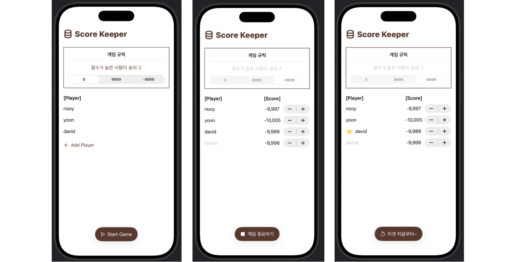

## [Data Modeling] 1-1. Custom types and Swift Testing: Model data with custom types

<https://developer.apple.com/tutorials/develop-in-swift/model-data-with-custom-types>

- 뷰가 없는 Swift file 생성하여 내가 필요한 struct type을 만들기

- Protocol 프로토콜
```Swift
struct Player: Identifiable { // 여기서 Identifiable 같은 애들은 Protocol 이라고 부름. 이 프로토콜을 따르는 애들(구조)이라는 뜻.
    let id = UUID() // 동일한 데이터 값이 들어와도 구분할 수 있도록 ID 를 주어야 함
    ...
}
```

- `ForEach`에서 배열
    - 배열을 만들고, `ForEach` 문에서 $바인딩하여 리스트에 접근하여 뷰에 표시할 수 있음.
```Swift
ForEach($players) { $player in
    TextField("Name", text: $player.name)
    Text("\(player.score)")
}
```

- `Grid`: 전체 표(테이블) 같은 컨테이너 -> 표처럼 깔끔하게 정렬시킬 수 있음!
```Swift
    Grid {
        GridRow {
```

## [Data Modeling] 1-2. Custom types and Swift Testing: Add functionality with Swift Testing

- 테스트해보는 방법 ...
    - 테스트 파일을 만들어서 밖에서 테스트를 함
    - `@testable import ScoreKeeper`
    모듈 이름은 문자로 시작해야 한다.. (프로젝트-TARGETS-Build Settings-Product Module Name-이름 변경)

- `Picker`
    - 사용자가 항목을 선택하면 picker의 $바인딩이 해당 .tag() 값으로 업데이트됨!!!

- `mutating func`
    - struct의 property(속성)를 변경할 수 있는 메서드(func)에는 mutating 키워드를 붙여야 함!!!
```Swift
mutating func resetScore(to newValue: Int) 
```


## Preview


