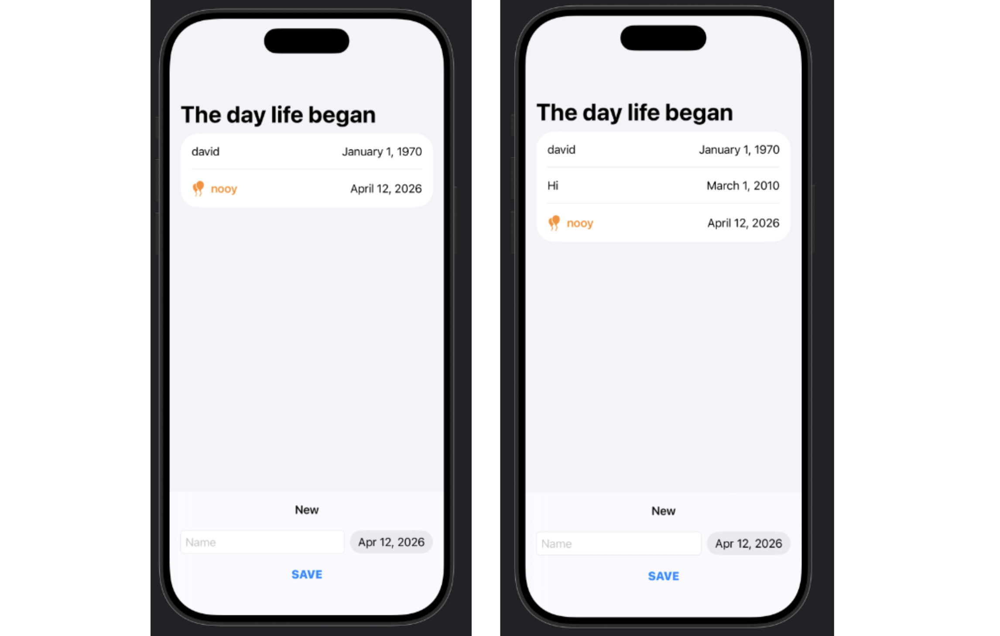

## [Data Modeling] 2. Models and persistence: Save data

<https://developer.apple.com/tutorials/develop-in-swift/save-data#Convert-your-structure-to-a-SwiftData-model>


"생일을 기억하는 데 도움이 되는 앱은 입력한 데이터를 저장하지 않으면 그다지 유용하지 않습니다. SwiftData 프레임워크를 사용하여 인스턴스를 생성하고 저장하면 Friend앱을 다시 실행했을 때도 데이터가 유지됩니다."

- class와 struct는 모두 데이터를 담지만, `class`의 인스턴스는 ((struct의 인스턴스에는 없는)) `고유한 identity` 을 가지고 있음!
    - `SwiftData`는 이 id를 사용하여 앱 전체에서 모델 데이터를 공유하고, 해당 데이터가 필요한 모든 뷰에서 접근할 수 있게!
    - 어떤 뷰에서든 모델을 수정하면, SwiftData는 그 변경 사항을 즉시 반영함

- class의 initializer(init)는 모든 property에 값을 할당하여 어떤 타입의 인스턴스를 생성함.
    - 구조체의 경우, Swift는 각 프로퍼티에 대응하는 매개변수를 가진 이니셜라이저를 자동으로 생성, 하지만 클래스는 자동으로 initializer가 생성되지 않기 때문에, 직접 만들어야 한다~

- 처음부터 다시 시작하려면? 시뮬레이터에서 앱을 삭제하거나 [기기] > [모든 콘텐츠 및 설정 지우기…]

- BrithdayApp.swift 에도 코드 넣어주어야 함
```Swift
    ContentView()
        .modelContainer(for: Friend.self)
    // 컨테이너: Friend 데이터가 저장되는 곳과 화면에 표시되는 ContentView 사이에서 동작하는 일종의 번역기와 같음.
    // Friend.self는 특정 Friend 인스턴스가 아니라 Friend라는 타입 자체를 참조
    // 컨테이너는 이 타입 설계도를 사용하여 모델이 어떻게 저장되어야 하는지를 이해함.
```


- `DatePicker`
    - newDate에 받아오겟다, 과거부터 지금만 선택가능, 시간은 빼고 날짜만 띄우겠다
```Swift
DatePicker(selection: $newDate, in: Date.distantPast...Date.now, displayedComponents: .date){
...}
```


```Swift
@Query(sort: \Friend.birthday) private var friends: [Friend]
```
- friends 배열의 어노테이션을 @Query로 하여 SwiftData에 저장된 Friend 인스턴스를 가져옴
- 이름에서 알 수 있듯이, @Query는 SwiftData에 데이터 배열을 요청 — 이 경우 [Friend]. SwiftData에 저장된 Friend 인스턴스를 업데이트하면, @State 프로퍼티처럼 해당 쿼리가 뷰를 자동으로 업데이트함.
- birthday 기준으로 sorting함!

    
```Swift
@Environment(\.modelContext) private var context
```
- ModelContext는 뷰와 모델 컨테이너 사이의 연결을 제공하여,
- 컨테이너 안의 데이터를 가져오고(fetch), 추가(insert)하고, 삭제(delete)할 수 있게 해줌.
- ContentView에 추가한 .modelContainer 수정자는 SwiftUI 환경에 modelContext를 주입하며, 이 modelContext는 해당 컨테이너 아래의 모든 뷰에서 접근할 수 있음


## Preview

