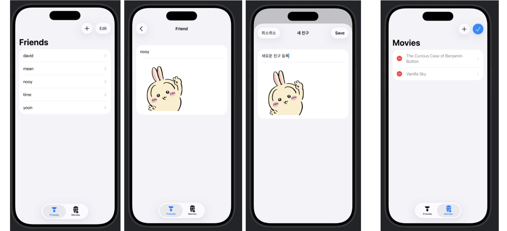

## [Data Modeling] 3-1. Navigation, editing, and relationships: Navigate sample data

<https://developer.apple.com/tutorials/develop-in-swift/navigate-sample-data>

- `NavigationSplitView`
    - NavigationSplitView를 사이드바와 디테일 영역으로 구성!
    - 사이드바에는 보통 항목들의 리스트가 포함되며, 각 항목을 선택하면 해당 항목에 대응하는 하위 뷰가 디테일 영역에 표시됨

- 데이터 관리하기 위한  `SampleData` 클래스 
    - `modelContainer`와 `Schema`의 등장
    - 스키마와 모델 config를 넘겨줄 모델컨테이너를 만듦
    ```Swift
    modelContainer = try ModelContainer(for: schema, configurations: [modelConfiguration])
    ```


## [Data Modeling] 3-1. Navigation, editing, and relationships: Create, update, and delete data

<https://developer.apple.com/tutorials/develop-in-swift/create-update-and-delete-data>


- 각 행을 스와이프하여 삭제하는 기능
    `.onDelete(perform: deleteMovie(indexes:))`
                

- 툴바 만들기
    - 정보를 추가(action: addfriend)할 수도 있고, 삭제(EditButton())할 수도 있음 .. 
                
```Swift
            // 추가
            .toolbar {
                // 툴바 누르면 -> 만들어둔 함수를 action 시켜서 -> 친구추가 되도록
                ToolbarItem{
                    Button("친구추가", systemImage: "plus", action: addFriend)
                }
                ToolbarItem(placement: .topBarTrailing) {
                    EditButton()
                }
            }
            // 옵셔널 프로퍼티(newFriend)에 값이 있을 때! (addFriend가 호출되면)
            // 시트를 표시하도록 트리거함....!!!
            .sheet(item: $newFriend) {friend in
                NavigationStack {
                    FriendDetail(friend: friend, isNew: true)
                }
                .interactiveDismissDisabled() // 아래로 끌어서 닫는 거 막기
            }
            
            
```        
## Preview 

