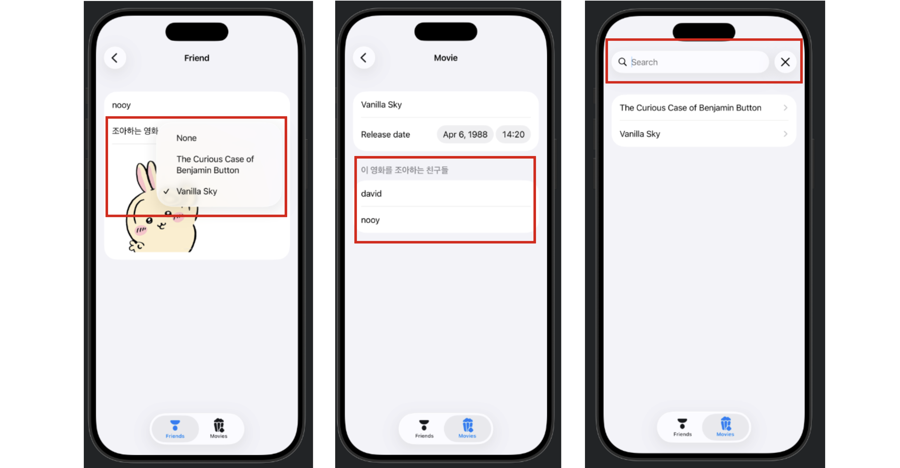

## [Data Modeling] 3-1. Navigation, editing, and relationships: Navigate sample data
##
<https://developer.apple.com/tutorials/develop-in-swift/navigate-sample-data>

- `NavigationSplitView`
    - NavigationSplitView를 사이드바와 디테일 영역으로 구성!
    - 사이드바에는 보통 항목들의 리스트가 포함되며, 각 항목을 선택하면 해당 항목에 대응하는 하위 뷰가 디테일 영역에 표시됨


- 데이터 관리하기 위한  `SampleData` 클래스 
    - `modelContainer`와 `Schema`의 등장
    - 스키마와 모델 config를 넘겨줄 모델컨테이너를 만듦
    ```Swift
    modelContainer = try ModelContainer(for: schema, configurations: [modelConfiguration])
    ```

---

## [Data Modeling] 3-2. Navigation, editing, and relationships: Create, update, and delete data

<https://developer.apple.com/tutorials/develop-in-swift/create-update-and-delete-data>


- **각 행을 스와이프하여 삭제**하는 기능
    `.onDelete(perform: deleteMovie(indexes:))`
                

- **툴바** 만들기
    - 정보를 추가(`action: addFriend`)할 수도 있고, 삭제(`EditButton()`)할 수도 있음 .. 
                
    ```Swift
        // 추가
        .toolbar {
            // 툴바 누르면 -> 만들어둔 함수를 action 시켜서 -> 친구추가 되도록
            ToolbarItem{
                Button("친구추가", systemImage: "plus", action: addFriend)
            }
            ToolbarItem(placement: .topBarTrailing) {
                EditButton()
            }
        }
        // 옵셔널 프로퍼티(newFriend)에 값이 있을 때! (addFriend가 호출되면)
        // 시트를 표시하도록 트리거함....!!!
        .sheet(item: $newFriend) {friend in
            NavigationStack {
                FriendDetail(friend: friend, isNew: true)
            }
            .interactiveDismissDisabled() // 아래로 끌어서 닫는 거 막기
        }
    ```
            
- 하나의 기본 화면을 만들어두고, 필요(상태-친구전체, 친구추가)에 따라서 기능 몇 개 넣고(e.g.,툴바) 재활용을 한다 ,,
    - 어떤 상태인지 파라미터로 구분을 함 (e.g., isNew: Bool)

  
## Preview 


---

## [Data Modeling] 3-3. Navigation, editing, and relationships: Work with relationships

<https://developer.apple.com/tutorials/develop-in-swift/work-with-relationships>

- **검색창** 만들기
    ```Swift
        MovieList(titleFilter: searchText)
            .searchable(text: $searchText)
    ```
- 검색이 가능하도록 Query 커스텀(?) 하기
    - `Predicate` 라는 것을 사용
    - Query 설정을 직접 바꾸는 것
    - `predicate` 조건으로 필터링 / title 기준 정렬 / 자동으로 movies에 반영됨
        - `_movies = Query(filter: predicate, sort: \Movie.title)`


    ```Swift
        // 이제 MovieList를 다른곳에서 부를 때, titleFilter를 파라미터로 받게됨.
        init(titleFilter: String = "") {
        
            // predicate는 SwiftData가 데이터를 필터링할 조건을 설명할 때 사용
            // predicate가 true를 반환하면 해당 항목을 표시하겠다는 의미
            let predicate = #Predicate<Movie> { movie in
                
                titleFilter.isEmpty || movie.title.localizedStandardContains(titleFilter)
                // 쿼리에 포함할 영화를 선택하는 조건문
                // --> “제목 필터가 비어 있거나, 영화 제목이 필터 텍스트를 포함하고 있다면 해당 영화를 포함한다.”
            
            }
            // predicate를 사용하여 _movies 프로퍼티를 초기화
            // 일반적으로는 이 프로퍼티를 직접 다루지 않지만, >>커스텀 쿼리<<를 만들 때는 직접 접근해야 함
            // 이러한 프로퍼티들은 뷰를 SwiftUI를 구동하는 엔진과 연결해줌
            _movies = Query(filter: predicate, sort: \Movie.title)
        }
    ```
- SwiftData 에서 **property 추가**하기 
    - SwiftData에서는 `@Model` 클래스에 프로퍼티를 추가하면 자동으로 데이터 필드나 relationship가 생성됨,,
    - 예를 들어 Movie 타입(`favoriteMovie`)을 추가하면 Friend와 Movie 사이의 관계가 자동으로 관리됨
    
    ```Swift
    @Model
    class Friend {
        var name: String
        var favoriteMovie: Movie? // 오 내가 만든 무비...
    ```

  
## Preview 

