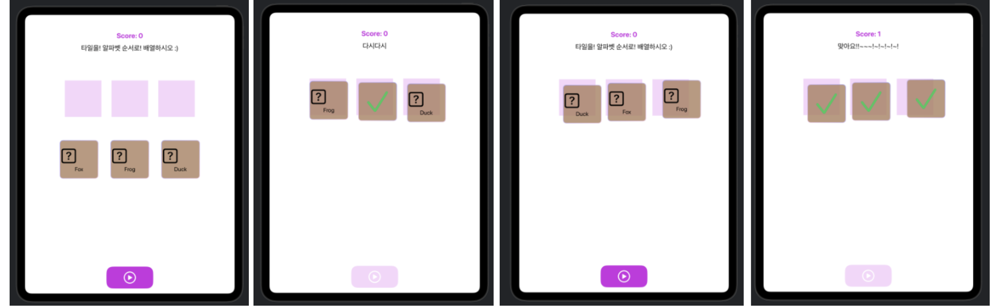

## [Data Modeling] 4.Observation and shareable data models: Complete a game with logic

<https://developer.apple.com/tutorials/develop-in-swift/complete-a-game-with-logic>

- `Alphabetizer.swift` 파일에서 데이터의 변화,, 함수,, 상태변화,, 저장,, 등 **데이터 관리의 모든 것**이 이루어짐
    - 데이터의 구조나 상태(enum) 같은 건 따로 파일을 만들고 `Alphabetizer.swift`에서 불러옴
    - 그리고 구조같은 걸 사용해서 데이터를 만들거나, 상태를 바꾸는 듯함.

- @Observable // 매크로: 클래스에 새로운 기능을 추가
    - @Observable을 사용하면 데이터의 진짜 출처(source of truth)가 뷰가 아니라! ""Tile 모델""로 이동하게 됨!!!!!!!! -- 데이터 저장 가능!

- WordCanvas.swift에 제스처 인식 기능 구현코드 있음

- 캔버스 새로고침 Editor > Canvas > Refresh Canvas 

- enum에 String 원시값(raw value)을 부여하면, 각 enum 케이스에 문자열 값을 연결할 수 있음! (... .instruction.rawValue)

## Preview

---
---
애플 제공 readme

# Alphabetizer: Complete a game with logic

In this tutorial, you’ll build a fully functioning iPad game for kids learning to spell, called Alphabetizer. Working with prewritten SwiftUI views, you’ll build a “brain” for the app: a data model that understands the game rules and connects to the user interface. You’ll use observable models to connect the data models and the SwiftUI views.

This project’s codebase is more complex than those in previous tutorials. As you work through the project, you’ll learn strategies for dealing with that extra complexity.

## Overview

These resources are associated with the [Complete a game with logic](https://developer.apple.com/tutorials/develop-in-swift/complete-a-game-with-logic) tutorial. This is part of the [Data Modeling](https://developer.apple.com/tutorials/develop-in-swift/welcome-to-data-modeling) tutorials from [Develop in Swift](https://developer.apple.com/tutorials/develop-in-swift) by Apple.

## Using these resources

Follow the tutorial instructions in section one of [Complete a game with logic](https://developer.apple.com/tutorials/develop-in-swift/complete-a-game-with-logic) to use these resources within the Xcode app.
