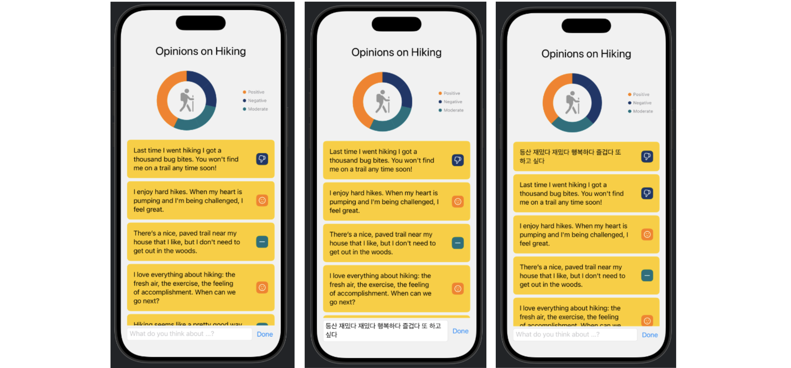
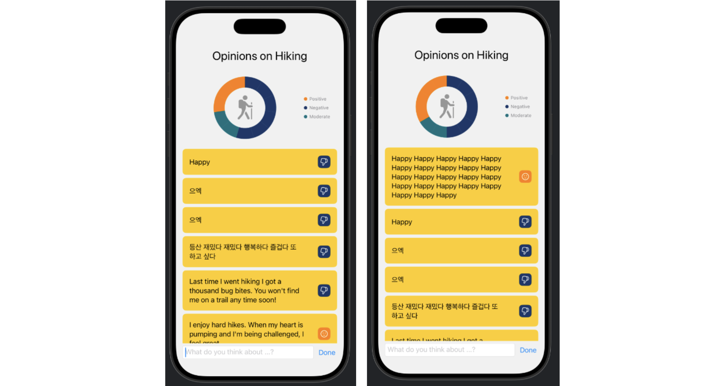

## [Machine learning and AI] 1. Natural language: Analyze sentiment in text
<https://developer.apple.com/tutorials/develop-in-swift/analyze-sentiment-in-text>


- struct에서 Identifiable을 쓰는 이유 :
    - SwiftUI에서 List, ForEach 같은 뷰를 쓸 때, 내부적으로는 “이 아이템이 이전에 있던 그 아이템이 맞는지”, “새로 추가된 건지, 삭제된 건지” 등을 판단해야 함. 이걸 위해 각 요소에 고유 ID가 필요
    ```Swift
        struct Response: Identifiable {
            var id = UUID()
            ...```
    
    
- sentiment 분석 코드 (`Scorer.swift`)
```Swift
class Scorer {
    
    // NLTagger 객체 생성
    // 이 tagger는 감성 분석 전용
    let tagger = NLTagger(tagSchemes: [.sentimentScore])
    
    // text를 입력받아서 점수를 리턴하는 함수
    func score(_ text: String) -> Double {
        var sentimentScore = 0.0
        
        tagger.string = text // 분석할 텍스트를 tagger에 전달
        
        // 텍스트를 순회하면서(tagging하면서) 분석 수행
        tagger.enumerateTags(
            // in: 텍스트 전체 범위를 분석
            in: text.startIndex..<text.endIndex,
            // unit: 문단 단위로 분석해라
            unit: .paragraph,
            // scheme: 어떤 종류의 분석인지
            scheme: .sentimentScore,
            //options: 추가 옵션 없음 // 클로저 (가장 중요)
            options: []) { sentimentTag, _ in // 클로저의 매개변수 / 텍스트에 대한 분석 결과가 담겨있음
                // 결과를 String으로 꺼냄 ( "1.0" 이런식 )
                if let sentimentString = sentimentTag?.rawValue,
                   // String → Double 변환
                   let score = Double(sentimentString) {
                    sentimentScore = score
                    return true
                }
                // 값이 없으면 순회 중단
                return false // enumerateTags 함수의 return(열거를 종료)
            }
        
        return sentimentScore // score 함수의 최종 return
    }
    
}```

- 차트 만들기: `import Charts`

- `enum`을 잘 쓰면 유용할 듯


## Preview



