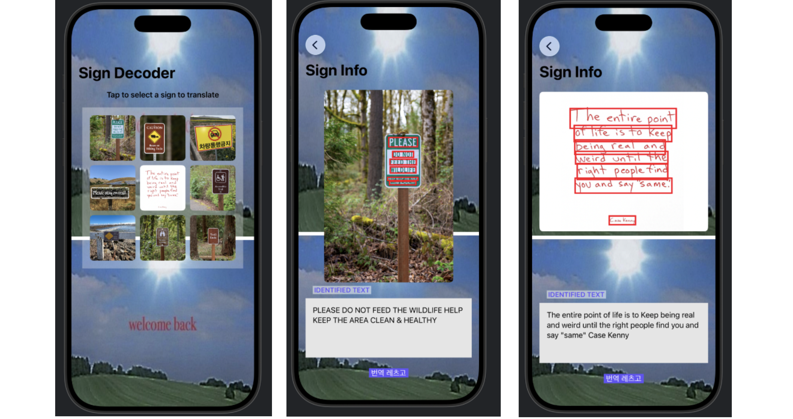
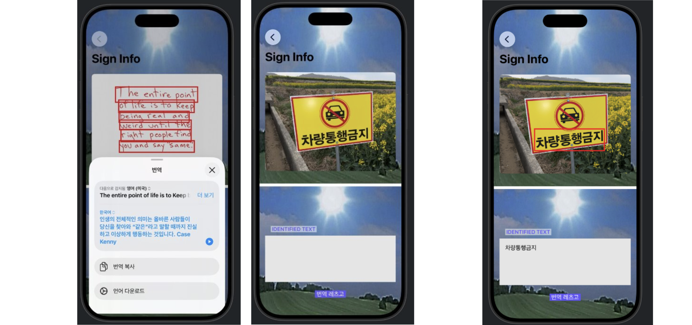

## [MLAI] 2. Recognize text in images: Extract text from images
<https://developer.apple.com/tutorials/develop-in-swift/extract-text-from-images>


- 번역 기능 넣기 `import Translation`

```Swift
// TranslationView.swift

import Translation

// machine translation~!!!
text("번역할아무문장")
    .translationPresentation(isPresented: $showingTranslation, text: text)
```


- 이미지에서 텍스트 인식 `import Vision`
     - 한국어도 인식할 수 있도록 설정
```Swift
// TextRecognizer.swift

import Foundation
import SwiftUI
import Vision // vision ML 프레임워크


struct TextRecognizer {
    
    // 인식 결과(들) 받아올 프로퍼티 배열
    var observations: [RecognizedTextObservation] = []
    // 진짜 최종 결과 텍스트 저장
    var recognizedText = ""

    
    init(imageResource: ImageResource) async {
        // 텍스트를 인식을 요청하는 프로퍼티
        var request = RecognizeTextRequest()
        
        // 한국어 추가
        request.recognitionLanguages = [
            Locale.Language(identifier: "ko-KR"),
            Locale.Language(identifier: "en-US")
        ]
        
        // 속도 성능 tradeoff 설정
        request.recognitionLevel = .accurate
        // 속도를 빠르게 하면 성능이 낮아짐
        // 비디오나 대량의 이미지를 처리할 때는 .fast가 나을 수도 있음 (.accurate가 디폴트)

        
        // Image는 View에 이미지를 표시, UIImage 이미지 그 자체를 의미
        let image = UIImage(resource: imageResource)
        
        // 이미지의 복사본이 PNG 데이터 형식으로 생성
        // 이미지 데이터 자체를 직접 처리하기 때문에 이미지에서 데이터를 추출해야 함.
        if let imageData = image.pngData(),
           // perform 요청은 실패할 수 있으므로, 결과가 있을 때만 계속 진행하기 위해 try?를 사용
           let results = try? await request.perform(on: imageData) {
            observations = results
            // RecognizedTextObservation은 Vision 프레임워크가 이미지 안에서 인식한 텍스트
            // results에는 (1) 가능한 결과라고 판단한 텍스트 값 목록, (2) 각 결과에 대한 신뢰도(confidence), (3) 이미지 내에서 해당 텍스트가 발견된 영역 정보가 포함됨
        }
        

        // 모델이 여러 개의 후보 값을 생성하기 때문에, 개수를 정해주기
        for observation in observations {
            let candidate = observation.topCandidates(1) // 반환 타입: array
            
            if let observedText = candidate.first?.string { // 1개짜리 배열에서 그 첫 번째를 꺼냄
                recognizedText += "\(observedText) "
            }
        }

    } //End init
}
```


- 텍스트를 전부 대문자로 바꾸기
    - `.textCase(.uppercase)`


- 로딩중 뷰 띄우기
    - `ProgressView() // 기본 제공 뷰`


---
## Preview




- 번역 기능과 한국어 인식
