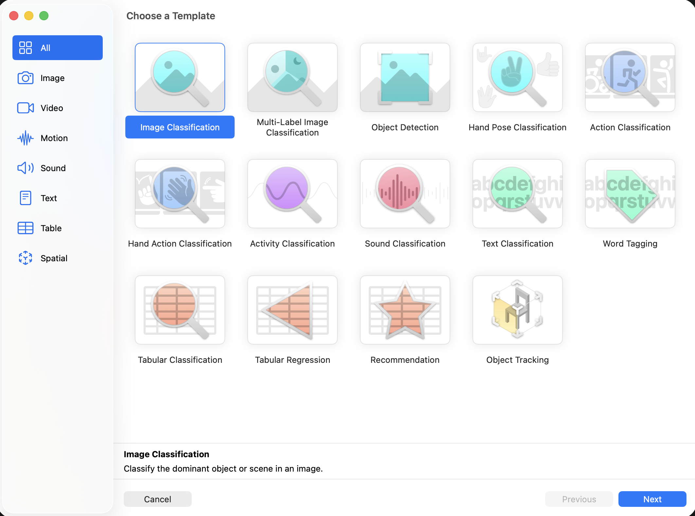
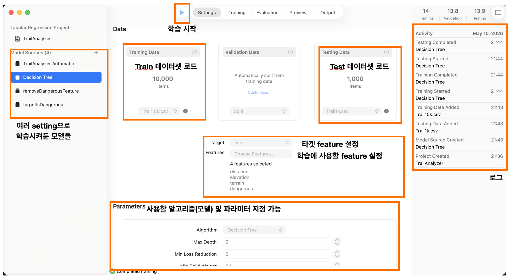

## [MLAI] 3. Model training with Create ML: Train a Core ML model
<https://developer.apple.com/tutorials/develop-in-swift/train-a-core-ml-model>

### CreateML에서 지원하는 테스크들

### 메인 윈도우

- 학습시킨 모델 사이즈가 매우 작다 (863 bytes)
