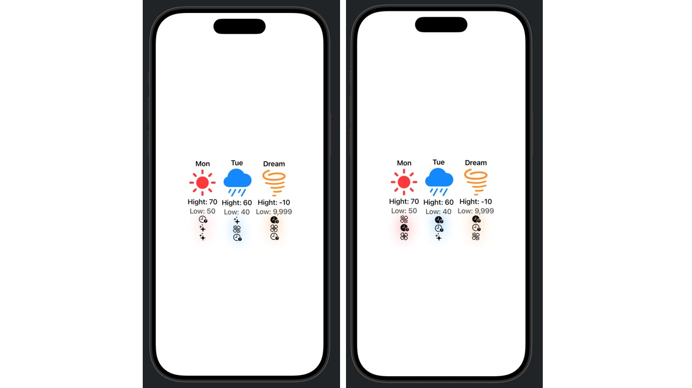

## [SwiftUI] 2. Views, structures, and properties

<https://developer.apple.com/tutorials/develop-in-swift/customize-views-with-properties>

- Repeated pattern → 반복되는 구조를 캡슐화하여 계속 불러올 수 있도록 만들기 (encapsulate a day’s forecast in its own structure to make a customizable forecast card.)
- properties 를 사용하여 customizable 하도록 

## Preview

- 아래에 랜덤 아이콘 생성
