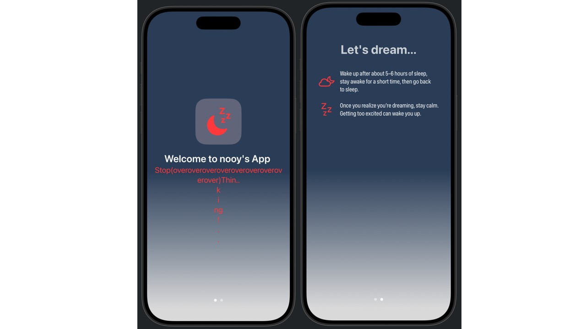

## [SwiftUI] 3. Layout and style: Design an interface

<https://developer.apple.com/tutorials/develop-in-swift/design-an-interface>

- `.border`를 사용하여 view의 사이즈를 확인 (Inspect the size of your views using borders)
- `ZStack`으로 그래픽 꾸미기 (RoundedRectangle에다가 이모지 쌓음)
- Assets 파일에 들어가서 AccentColor 조정 가능 & 새로운 색상 추가 가능
- `.background(Gradient(colors: GradientColors))`로 그래디언트 배경 추가
- 이미지 사이즈 지정하려면 `.frame(width:130, height:130)` 모디파이어로 조정 가능

## Preview
