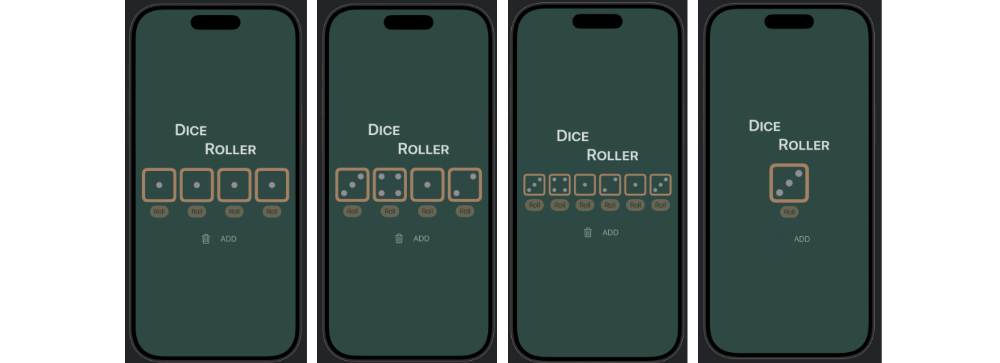

## [SwiftUI] 4. Buttons and state: Update the UI with state

<https://developer.apple.com/tutorials/develop-in-swift/update-the-ui-with-state>

- `for` loop과 `ForEach`
for문 = 그냥 반복 실행 (로직용)
ForEach = SwiftUI에서 “뷰를 반복 생성” (UI용)
- `.frame` 모디파이어를 사용해서 배경(background)이 전체에 적용(확장)되도록 조정
- `.tint` 모디파이어는 accent color에 해당하는 뷰의 색상만 바꿔줌

- `@State private`
@State: 
SwiftUI는 기본적으로 변수가 바뀌는 걸 모니터링하지 않음. 따라서 @State를 붙여줌으로써 변수가 바뀌는 모니터링하면서 값이 바뀌면 view를 바로바로 업데이트하도록 함.

private
뷰의 상태(State)는 그 뷰의 소유임. 따라서 private 라고 써줌으로써 다른뷰에서 상태에 간섭하지 못하도록 설정

## Preview

