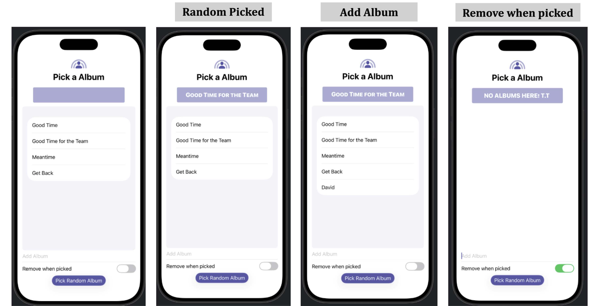

## [SwiftUI] 5. Lists and text fields: Create dynamic content

<https://developer.apple.com/tutorials/develop-in-swift/create-dynamic-content>


- $바인딩 사용한 부분: `TextField` `Toggle`
``` Swift
TextField("Add Album", text: $nameToAdd)
    .onSubmit{ 액션클로저 - 사용자가 Return 키를 눌렀을 때 실행할 명령형 코드 }
Toggle("Remove when picked", isOn: $shouldRemovePickedName)
```


- 배열에서 랜덤값 반환하기
    ```Swift
     if let randomAlbum = names.randomElement() {...}
     ```
    - 배열이 비어있으면 `.randomElement()`는 nil 을 반환하기 때문에, if let 으로 nil일 경우를 처리


- `removeAll { 조건 }` : 조건을 만족하는 모든 요소를 삭제
``` Swift
names.removeAll { name in
    return (name == randomAlbum)
}
```


- 버튼 만들기
``` Swift
Button {
    액션 클로저 -> 버튼을 눌렀을 때 변화시킬 내용
} label: {
    레이블 클로저 -> 어떤 뷰든간에 버튼으로 만들 수 있음!
}
```


## Preview


